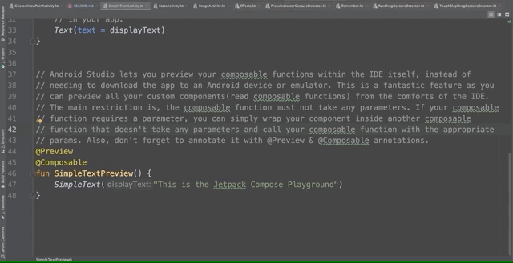

# Jetpack Compose Playground

Over the course of the last few years Android development has gone
through significant changes in how we structure our apps, the language
we use for development, the tooling & libraries that help us speed up
our development and the improvements in testing our apps. What had not
changed in all these years is the Android UI toolkit. This changes with
Jetpack Compose that aims to re-imagine what Android UI development
would look like using declarative programming principles. It is heavily
influenced by existing web and mobile frameworks such as React, Litho,
Vue & Flutter and would be a paradigm shift in Android UI development as
we know it.

This repository aims to show the Jetpack Compose way of building common
Android UI that we are accustomed to building.

Examples
-----------------

Each example is meant to be self contained and tries to explain all the
concepts that its using with comments. Compose also comes with this
nifty feature that lets you preview each component in the IntelliJ IDE
itself. To do so, go to any of the examples examples and the click on
the preview button in the top right corner. This is possible if your
@Composable component has a corresponding @Preview method associated
with it. Dive into the examples to understand what exactly this means.

Credits
-----------------
Author: Vinay Gaba (vinaygaba@gmail.com)

License
-----------------

    Copyright 2020 Vinay Gaba

    Licensed under the Apache License, Version 2.0 (the "License");
    you may not use this file except in compliance with the License.
    You may obtain a copy of the License at

       http://www.apache.org/licenses/LICENSE-2.0

    Unless required by applicable law or agreed to in writing, software
    distributed under the License is distributed on an "AS IS" BASIS,
    WITHOUT WARRANTIES OR CONDITIONS OF ANY KIND, either express or implied.
    See the License for the specific language governing permissions and
    limitations under the License.